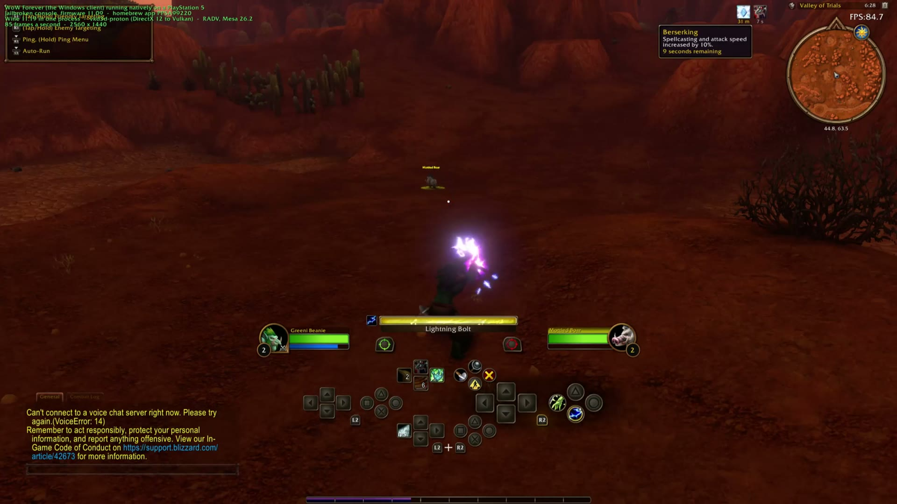
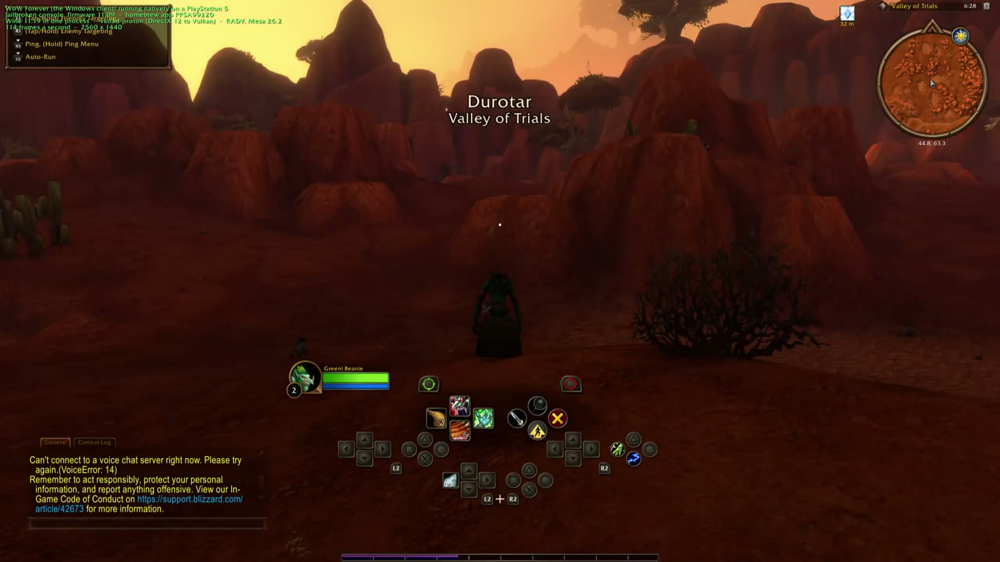
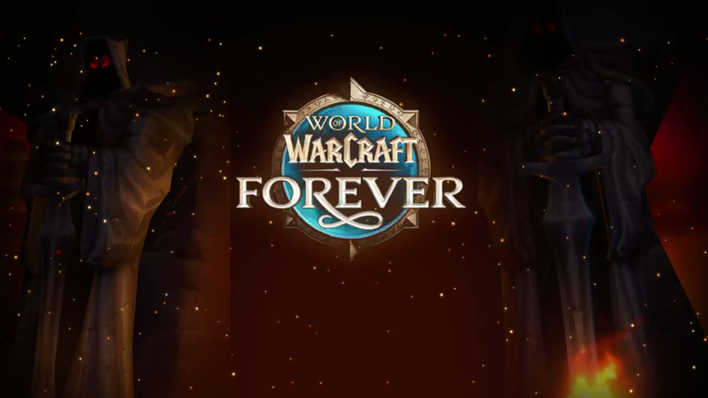

# WoW Forever on PS5

**World of Warcraft: Forever, the Windows client, running natively on a jailbroken PlayStation 5.**
No streaming and no Linux: the game's own `WowB.exe` runs inside one PS5 app, on Wine, with its DirectX 12 translated to the console's GPU.



| | |
|---|---|
|  |  |

*Captured from a PS5 over Remote Play. The green text in the corner was a debug label used for the recording; it is not part of the release.*

| | |
|---|---|
| **Works** | Login, character select, playing in the world, sound, controller (the game's own console UI), touchpad as a mouse, USB keyboard and mouse, an on-screen keyboard, 76 to 99 frames a second in the world with vertical sync off |
| **Tested on** | One console: PS5 firmware 8.20, etaHEN with kstuff, ShadowMount+ 1.6 beta 16; client builds 1.60.1.70205 and 1.60.1.70235 (`_classic_beta_`) |
| **Not included** | The game. You copy your own installation, and you sign in with your own account on the console |

This is a hobby project. It is not affiliated with or endorsed by Blizzard Entertainment or Sony. Use it with a game you own, at your own risk.

---

## Install it (about 15 minutes of your time, plus the copy)

### What you need

1. **A jailbroken PS5** with a homebrew enabler running (tested: etaHEN with kstuff), and:
   - its **FTP server** on (port 2121 is the default of the common payloads),
   - **ShadowMount** (or another way to register an app folder from `/data/homebrew`),
   - about **70 GB free** on the internal drive.
2. **A PC on the same network** with Python 3 (Linux, macOS or Windows).
3. **Your own World of Warcraft installation** with the `_classic_beta_` folder (WoW: Forever) in it.
4. The console's address on your network (PS5: Settings, Network, View Connection Status).

### Steps

1. Download **`WoWForever-PS5.zip`** from the [latest release](../../releases/latest) and unpack it.
2. Turn the console on and run your jailbreak, so that FTP and ShadowMount are up.
3. Copy the files to the console, either way:

   **A. With the installer** (it copies everything, your game included, and can be re-run if interrupted):

   ```sh
   cd WoWForever-PS5
   python3 install.py --host 192.168.1.50 --wow "/path/to/World of Warcraft"
   ```

   `--host` is the console's address; `--wow` is your game folder, the one that holds `_classic_beta_` and `Data`. Nothing needs editing.

   **B. By hand**, with any FTP program (FileZilla, WinSCP) connected to the console on port 2121:

   | Copy this | To this place on the PS5 |
   |---|---|
   | the folder `title/PPSA99220` | `/data/homebrew/PPSA99220` |
   | the folder `runtime/wowps5/wine` | `/data/wowps5/wine` |
   | the file `runtime/wowps5/ca-certificates.crt` | `/data/wowps5/ca-certificates.crt` |
   | the three `.reg` files in `runtime/wowps5/prefix` | `/data/wowps5/prefix/` |
   | everything inside `runtime/wowps5/prefix/drive_c` | `/data/wowps5/prefix/dosdevices/c:/` (the last folder is named `c:`, with the colon) |
   | your game's `Data` folder and `_classic_beta_` folder | `/data/wowps5/prefix/dosdevices/c:/Games/World of Warcraft/` |

   From `_classic_beta_`, leave out `WTF`, `Interface`, `Cache`, `Logs` and `Errors`: PC settings do not suit the console, and the game makes these again.

4. On the console, **WoW Forever** appears on the home screen within a minute. Start it.
5. Sign in. Press **L3 + R3** (click both sticks) to type with the on-screen keyboard.

Your installation on the PC is only read. The game is about 64 GiB, so the copy takes a while over FTP.

The first start, and the first visit to each place, are slower than later ones: the graphics driver compiles the game's shaders once and keeps them.

### When the game updates

The console cannot update the game itself. Let Battle.net update it on the PC, close the game on the console, then run the installer again with `--skip-app`:

```sh
python3 install.py --host 192.168.1.50 --wow "/path/to/World of Warcraft" --skip-app
```

It sends only the files the update changed (a few GiB, not the whole game). If your first copy was made by hand or with release 0.1.0, add `--since "YYYY-MM-DD HH:MM"` with the time of that copy, once: an update changes files without changing their size, and the installer has to know which are newer. By hand, copy `Data` and `_classic_beta_` again, replacing what is there.

A new version of this port is installed the same way as the first: unpack the new release and run the installer (or copy `title/PPSA99220` again). Your game, settings and shaders on the console stay.

---

## Playing

### Controls

| Input | What it does |
|---|---|
| Controller | The game's own controller support and console UI |
| Touchpad | Moves the mouse pointer; pressing it is a left click |
| **L3 + R3** (click both sticks together) | Opens the PS5 on-screen keyboard. What you type goes into the text box that has focus (login, search, chat), when you confirm |
| **L3 + R3 again**, before pressing anything else | Opens the keyboard with what you just typed, to fix a mistake: confirming replaces the old text. Confirming an empty keyboard just deletes it |
| USB keyboard and mouse | Work as on a PC |

### Frame rate above 60 (the uncapped mode)

By default a PS5 app gets exactly as many frames as the TV shows. This port adds a second way of presenting to the graphics driver, where the game draws as fast as it can and the screen shows the newest finished frame at each refresh, with no tearing.

To use it, in the game: **System, Graphics, turn Vertical Sync off**, and set **Max Foreground FPS** to what you like (or off). The game's frame counter then goes above 60 and input feels more direct; the TV still shows its own refresh rate. Turning Vertical Sync back on returns to the default.

### Good to know

- **Leaving the game:** use the game's own Exit Game. It takes about ten seconds to close.
- **Settings and add-on data** are saved on the console when you leave the game normally.
- **A "system software" message** from the PS5 while the game runs can be dismissed.
- **No voice chat.**
- **Advanced settings** go in `/data/wowps5/launch.txt` on the console, one `NAME=value` a line. For example `PS5_VIDEOOUT_MAILBOX=0` removes the uncapped mode, and `VKD3D_CONFIG=` turns off single-queue mode (the default is `single_queue`). Delete the file to return to the defaults.

### If something goes wrong

| What you see | What to do |
|---|---|
| The installer says there is no FTP server | Check the console's address, that the jailbreak ran, and that its FTP server is on port 2121 (`--port` to change it) |
| No "WoW Forever" on the home screen | ShadowMount must be loaded; it looks in `/data/homebrew`. Removing the tile and letting it be added again also refreshes its name and pictures |
| A black screen for a long time on the very first start | Wait: the first start compiles shaders. Later starts are much faster |
| The game closes on start | Make sure the copy finished (run the installer again; it only sends what is missing) and that the client is the build above |
| The game has updated on your PC | The console's copy needs the same update: see [When the game updates](#when-the-game-updates) |
| The picture freezes in the world (sound may carry on) | Close the game from the PS button and start it again. Release 0.1.1 fixes two crashes of this kind that came with client build 70235; a crash still shows as a frozen picture because the game's crash window is not visible on the console |
| Lua warnings about SavedVariables, or settings that do not stick | Update to the latest release: this was a limit of 250 open files that the port now stays under |

---

## How it works, in one paragraph

A PS5 app cannot start a second program, has 16 KiB memory pages, may not read its own code, and gets about 250 open files. So Wine 11.19 runs as **one process** inside the app, with its server on a thread and its Unix side linked into the app's executable; a memory layer gives Windows programs the 4 KiB pages and executable memory they expect; **vkd3d-proton** turns the game's DirectX 12 into Vulkan; and **RADV** (Mesa's driver, in Mihawk's PS5 port) drives the console's GPU. Every change to Wine is one patch against a pinned revision, and each exists for something measured on the console: see [docs/technical-notes.md](docs/technical-notes.md).

## What is in this repository

| Here | What |
|---|---|
| `app/` | The PS5 app: the platform side (`app/ps5`), and what it does around Wine (`app/runtime`: start-up, files, sound, controller, on-screen keyboard) |
| `runtime/wine-ps5/` | Every change to Wine as one patch, and the memory layer |
| `runtime/radv-ps5/` | The uncapped present mode, as a patch to the graphics driver's display code |
| `tools/` | Build, install, run and test scripts; the Windows test programs |
| `docs/` | [Technical notes](docs/technical-notes.md): what was measured on the console and why each change exists |

Not here: the game, anything of an account, and the third-party source (`vendor/`, fetched at the revisions pinned in `dependencies.json`).

## Building it yourself

The release bundle is the supported way to install. Building from source works in the author's tree and has **not yet been reproduced from a fresh clone**, so expect to read the scripts:

```sh
python3 tools/bootstrap.py                 # pinned sources and host packages into vendor/ and .deps/
cp .env.example .env                       # then set WOW_INSTALL; console settings go in vendor/PS5_Vulkan/.env
bash tools/wine-ps5/build-radv.sh          # the graphics driver with this project's patch
bash tools/wine-ps5/build-console.sh       # Wine's Unix side, the app, and its deployment to the console
python3 tools/wine-ps5/stage-console.py --all --system32   # Wine's Windows side to the console
python3 tools/wine-ps5/stage-game.py       # your game to the console
```

The host needs Linux with LLVM 23, mingw-w64, meson, ninja and cmake. `runtime/wine-ps5/README.md` describes the Wine patch; `tools/make-bundle.py` makes the release bundle from a console where everything works.

## Credits and licences

- [Wine](https://www.winehq.org/) (LGPL-2.1-or-later); the patch here is under the same licence.
- [vkd3d-proton](https://github.com/HansKristian-Work/vkd3d-proton) (LGPL-2.1).
- [Mesa](https://www.mesa3d.org/) RADV (MIT) in [Mihawk's PS5 port](https://github.com/mihawk-99/PS5_Mesa), and his [PS5_Vulkan](https://github.com/mihawk-99/PS5_Vulkan).
- The [PS5 payload SDK](https://github.com/ps5-payload-dev/sdk).
- The licence texts of everything the app contains are in the bundle under `title/PPSA99220/licenses/`.

World of Warcraft and Blizzard Entertainment are trademarks of Blizzard Entertainment, Inc. PlayStation and PS5 are trademarks of Sony Interactive Entertainment Inc. The pictures used for the app's tile and background are fan-made from publicly available artwork.
